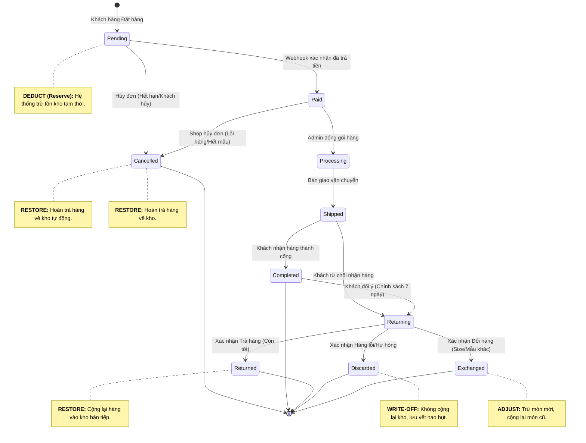

# Đặc tả Quy trình Nghiệp vụ & Vòng đời Đơn hàng - Niee8

Tài liệu này mô tả chi tiết các trạng thái của một đơn hàng trong hệ thống Niee8 và các quy tắc nghiệp vụ (Business Rules) đi kèm để đảm bảo tính chính xác của kho hàng và trải nghiệm khách hàng.

## 1. Sơ đồ Vòng đời Đơn hàng Toàn diện

## 2. Định nghĩa các Trạng thái & Quy tắc Kho hàng

### 2.1. Nhóm Trạng thái Bán hàng
- **Pending (Chờ thanh toán):** Đơn hàng vừa khởi tạo. Hệ thống thực hiện **Trừ kho ngay lập tức** để giữ hàng cho khách trong vòng 15 phút.
- **Paid (Đã thanh toán):** Tiền đã về tài khoản. Đơn hàng sẵn sàng để xử lý.
- **Processing (Đang chuẩn bị):** Nhân viên kho đang lấy hàng và đóng gói. Không thể hủy đơn từ phía khách hàng ở bước này.
- **Shipped (Đang giao):** Hàng đã rời kho. Trách nhiệm thuộc về đơn vị vận chuyển.

### 2.2. Nhóm Trạng thái Hủy & Trả hàng
- **Cancelled (Đã hủy):** Đơn hàng dừng lại trước khi giao. Hệ thống thực hiện **Hoàn kho 100%**.
- **Returning (Đang thu hồi):** Hàng đang trên đường quay về kho. Kho chưa được cập nhật ở bước này.
- **Returned (Đã trả hàng - Tốt):** Hàng về kho, kiểm tra đạt chuẩn. Hệ thống thực hiện **Cộng lại kho**.
- **Discarded (Đã hủy bỏ - Hư hỏng):** Hàng về kho nhưng bị lỗi/hỏng. Hệ thống **Không cộng lại kho** nhưng ghi nhận vào báo cáo hao hụt.

## 3. Các điểm mấu chốt về Nghiệp vụ (Business Rules)

1.  **Tính chính xác (Inventory Accuracy):** Mọi thay đổi kho hàng phải đi kèm với một `reference_id` (Mã đơn hàng) để truy xuất nguồn gốc.
2.  **Thời gian giữ hàng (Expiry):** Đơn hàng `Pending` qua cổng PayOS có thời hạn 15 phút. Sau thời gian này, hệ thống tự động hủy đơn và giải phóng hàng.
3.  **Bảo vệ mã giảm giá:** Khi đơn hàng bị hủy (`Cancelled`) hoặc trả hàng (`Returned`), lượt sử dụng của mã giảm giá phải được tự động hoàn lại cho khách hàng.
4.  **Minh bạch (Audit Trail):** Mọi thao tác chuyển trạng thái đơn hàng đều được lưu vết trong nhật ký hệ thống để đối soát khi có khiếu nại.

---
**Tài liệu này là căn cứ để xây dựng giao diện Admin và logic Database cho Niee8.**
