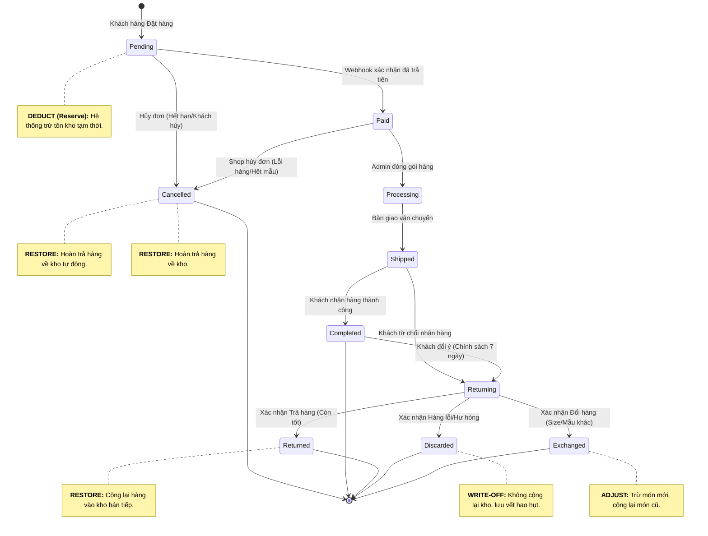

# Đặc tả Quy trình Nghiệp vụ & Vòng đời Đơn hàng - Niee8

Tài liệu này mô tả chi tiết các trạng thái của một đơn hàng trong hệ thống Niee8 và các quy tắc nghiệp vụ (Business Rules) đi kèm để đảm bảo tính chính xác của kho hàng và trải nghiệm khách hàng.

## 1. Sơ đồ Vòng đời Đơn hàng Toàn diện

## 2. Định nghĩa các Trạng thái & Quy tắc Kho hàng

### 2.1. Nhóm Trạng thái Bán hàng
- **Pending (Chờ thanh toán):** Đơn hàng vừa khởi tạo. Hệ thống thực hiện **Trừ kho ngay lập tức** để giữ hàng cho khách trong vòng 15 phút.
- **Paid (Đã thanh toán):** Tiền đã về tài khoản. Đơn hàng sẵn sàng để xử lý.
- **Processing (Đang chuẩn bị):** Nhân viên kho đang lấy hàng và đóng gói. Không thể hủy đơn từ phía khách hàng ở bước này.
- **Shipped (Đang giao):** Hàng đã rời kho. Trách nhiệm thuộc về đơn vị vận chuyển.

### 2.2. Nhóm Trạng thái Hủy & Trả hàng
- **Cancelled (Đã hủy):** Đơn hàng dừng lại trước khi giao. Hệ thống thực hiện **Hoàn kho tự động qua Database Trigger**. Cơ chế này đảm bảo hàng được trả về kể cả khi đơn bị hủy bởi Cronjob, Webhook thất bại hoặc Admin xóa DB.
- **Returning (Đang thu hồi):** Hàng đang trên đường quay về kho. Kho chưa được cập nhật ở bước này.
- **Returned (Đã trả hàng - Tốt):** Hàng về kho, kiểm tra đạt chuẩn. Hệ thống thực hiện cộng lại kho qua thủ tục nhập kho thủ công (Manual Restock).
- **Discarded (Đã hủy bỏ - Hư hỏng):** Hàng về kho nhưng bị lỗi/hỏng. Hệ thống **Không cộng lại kho** nhưng ghi nhận vào báo cáo hao hụt.

## 3. Các điểm mấu chốt về Nghiệp vụ (Business Rules)

1.  **Tính chính xác (Inventory Accuracy):** Sử dụng cơ chế Row-level locking (`FOR UPDATE`) trong RPC để đảm bảo tồn kho luôn chính xác trong môi trường cạnh tranh cao.
2.  **Đồng bộ Expiry (Race Condition Fix):** Link thanh toán PayOS và Đơn hàng Pending đồng loạt hết hạn sau 15-30 phút. Điều này ngăn chặn việc khách hàng thanh toán cho một đơn hàng đã bị hệ thống hủy và giải phóng kho.
3.  **Hệ thống Lưu vết Kho (Audit Trail):** Mọi biến động kho (trừ khi đặt hàng, cộng lại khi hủy) đều được ghi nhận vào bảng `stock_movements`. Điều này cho phép hậu kiểm chi tiết lý do tại sao số lượng kho thay đổi.
4.  **Quy tắc Cộng dồn Mã giảm giá (Stacking Rules):** 
    - Mỗi đơn hàng tối đa 1 mã Vận chuyển (loại 'shipping') và 1 mã Cửa hàng (loại 'total'/'shop').
    - **Logic chốt:** Giảm giá Shop không được trừ vào phí ship. Khách hàng luôn phải thanh toán phần `ShippingFee - ShipDiscount`.
5.  **Traceability:** Mọi đơn hàng PayOS được định danh bằng một `payos_order_code` (BigInt) duy nhất để tránh trùng lặp mã thanh toán.
6.  **Bảo vệ mã giảm giá:** Logic hoàn lại lượt dùng mã giảm giá được tích hợp trong Database, tự động kích hoạt khi trạng thái chuyển sang `cancelled`.

---
**Tài liệu này là căn cứ để xây dựng giao diện Admin và logic Database cho Niee8.**
