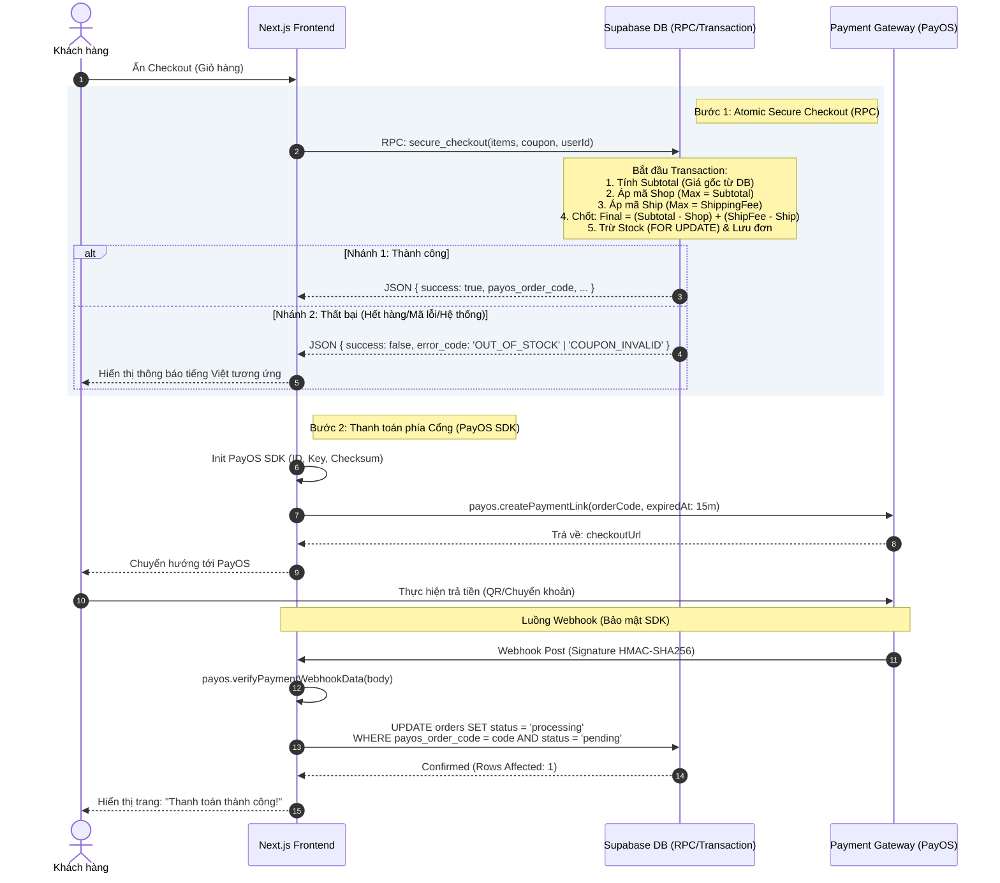

# Sequence Diagram: Luồng Thanh toán Niee8 (Checkout Flow)

Sơ đồ này mô tả chi tiết cách hệ thống xử lý một đơn hàng từ khi khách hàng nhấn nút Thanh toán cho đến khi xác nhận giao dịch thành công.

### 🛠 Giải thích kỹ thuật:
1.  **Atomic Transaction:** Không có kẽ hở giữa việc kiểm tra hàng và trừ kho. Mọi thứ diễn ra trong một nhịp đập duy nhất của Database.
2.  **Server-side Pricing:** Giá tiền được tính toán lại 100% dựa trên bảng `products`. Mọi can thiệp giá từ Client đều bị vô hiệu hóa.
3.  **SDK Standard:** Sử dụng thư viện chính thức từ PayOS để đảm bảo chữ ký Webhook và link thanh toán luôn đạt chuẩn bảo mật mới nhất.
4.  **Idempotency & Concurrency:** Sử dụng `payos_order_code` và kiểm tra trạng thái ngay khi update để tránh việc xử lý trùng lặp webhook khi có độ trễ mạng.

---
**Sơ đồ này đảm bảo hệ thống Nie8 vận hành minh bạch, chính xác 100% về kho hàng và tài chính.**
