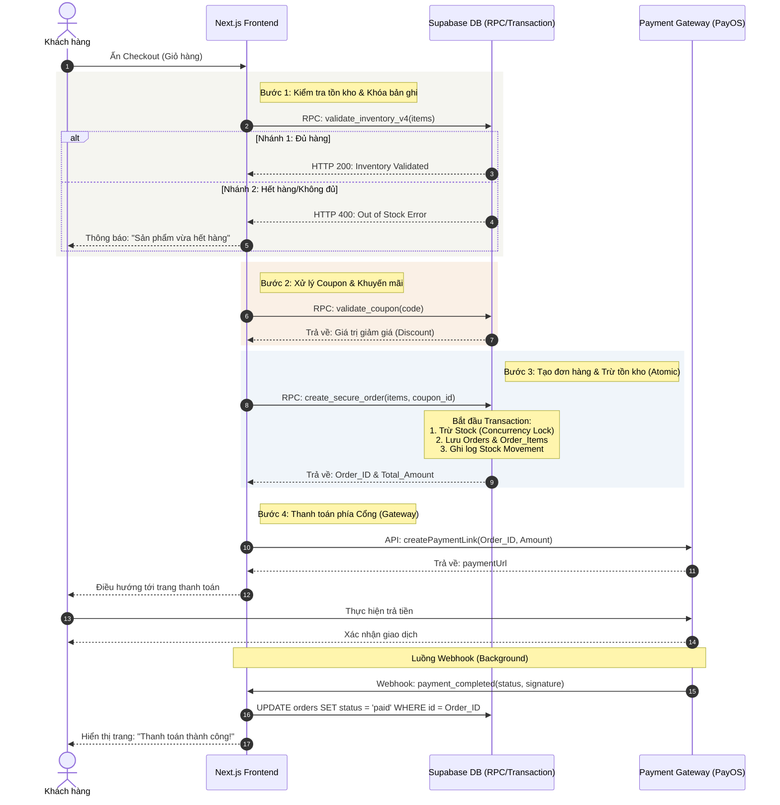

# Sequence Diagram: Luồng Thanh toán Niee8 (Checkout Flow)

Sơ đồ này mô tả chi tiết cách hệ thống xử lý một đơn hàng từ khi khách hàng nhấn nút Thanh toán cho đến khi xác nhận giao dịch thành công.

### 🛠 Giải thích kỹ thuật cho Backend:
1.  **Xử lý Concurrency (Bước 1 & 3):** Sử dụng các hàm RPC (Stored Procedures) với cơ chế `SELECT FOR UPDATE` hoặc các ràng buộc `CHECK (stock >= 0)` để đảm bảo khi 2 khách hàng cùng mua món cuối cùng, chỉ 1 người thành công.
2.  **Tính nguyên tử (Atomicity):** Các bước tạo Order và trừ Stock được bọc trong một Database Transaction. Nếu bước tạo Order lỗi, Stock sẽ tự động được Rollback.
3.  **Bảo mật:** Webhook từ Cổng thanh toán được kiểm tra chữ ký (Signature Verification) trước khi cập nhật trạng thái đơn hàng để chống gian lận.

---
**Sơ đồ này đảm bảo hệ thống Nie8 vận hành minh bạch, chính xác 100% về kho hàng và tài chính.**
