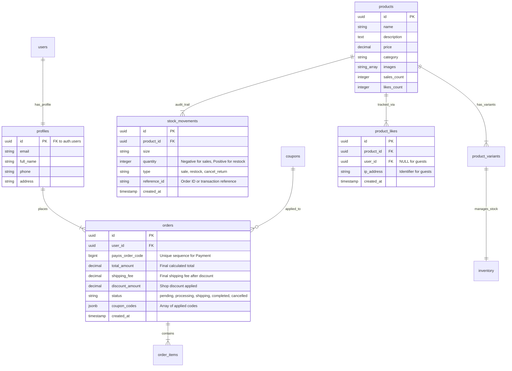

# Đặc tả Thiết kế Cơ sở Dữ liệu - Niee8 E-commerce (V5.2)

Tài liệu này trình bày kiến trúc cơ sở dữ liệu chuẩn hóa cho hệ thống thời trang Niee8, tập trung vào bảo mật tuyệt đối, tính minh bạch và khả năng tra soát (Audit Trail).

## 1. Sơ đồ Thực thể Liên kết (ERD)



## 2. Chiến lược Đánh chỉ mục (Indexing Strategy)

| Loại Index | Mục tiêu | Cột áp dụng |
| :--- | :--- | :--- |
| **B-Tree (Unique)** | Chống spam Like | `product_likes(product_id, ip_address, user_id)` |
| **B-Tree (Unique)** | Tra cứu đơn hàng | `orders(payos_order_code)`, `coupons(code)` |
| **Composite B-Tree** | Tra soát kho | `stock_movements(product_id, size, created_at)` |
| **GIN (JSONB)** | Tìm kiếm mã giảm giá | `orders(coupon_codes)` |

## 3. Mã triển khai (SQL Script - Phiên bản V5.2)

```sql
-- 1. Bảng lưu vết kho (Audit Trail)
CREATE TABLE stock_movements (
    id UUID PRIMARY KEY DEFAULT gen_random_uuid(),
    product_id UUID REFERENCES products(id),
    size TEXT,
    quantity INTEGER,
    type TEXT,
    reference_id TEXT,
    created_at TIMESTAMPTZ DEFAULT NOW()
);

-- 2. Bảng bảo mật lượt thích (Robust Likes)
CREATE TABLE product_likes (
    id UUID PRIMARY KEY DEFAULT gen_random_uuid(),
    product_id UUID REFERENCES products(id),
    user_id UUID REFERENCES auth.users(id),
    ip_address TEXT,
    created_at TIMESTAMPTZ DEFAULT NOW(),
    UNIQUE(product_id, user_id),
    UNIQUE(product_id, ip_address)
);

-- 3. Cập nhật RPC secure_checkout (Phiên bản V5.2)
-- Đã triển khai logic: (Subtotal - ShopDiscount) + (ShippingFee - ShipDiscount)
```

## 4. Nguyên tắc Vận hành (Architectural Best Practices)

- **Zero-Trust Pricing (V5.2):** Mã Shop chỉ giảm tối đa bằng `Subtotal`. Mã Ship chỉ giảm tối đa bằng `ShippingFee`. Tổng thanh toán luôn >= Phí ship sau giảm.
- **Audit Logging:** Mọi thay đổi kho đều phải có 1 bản ghi tương ứng trong `stock_movements`. Tuyệt đối không update trực tiếp stock mà không có reference.
- **Race Condition Prevention:** Sử dụng `FOR UPDATE` trong RPC để khóa bản ghi Sản phẩm và Coupon trong suốt quá trình xử lý đơn hàng.
- **Bot Mitigation:** Tích hợp kiểm tra IP và User-Agent tại Middleware để bảo vệ các API CRUD quan trọng.
