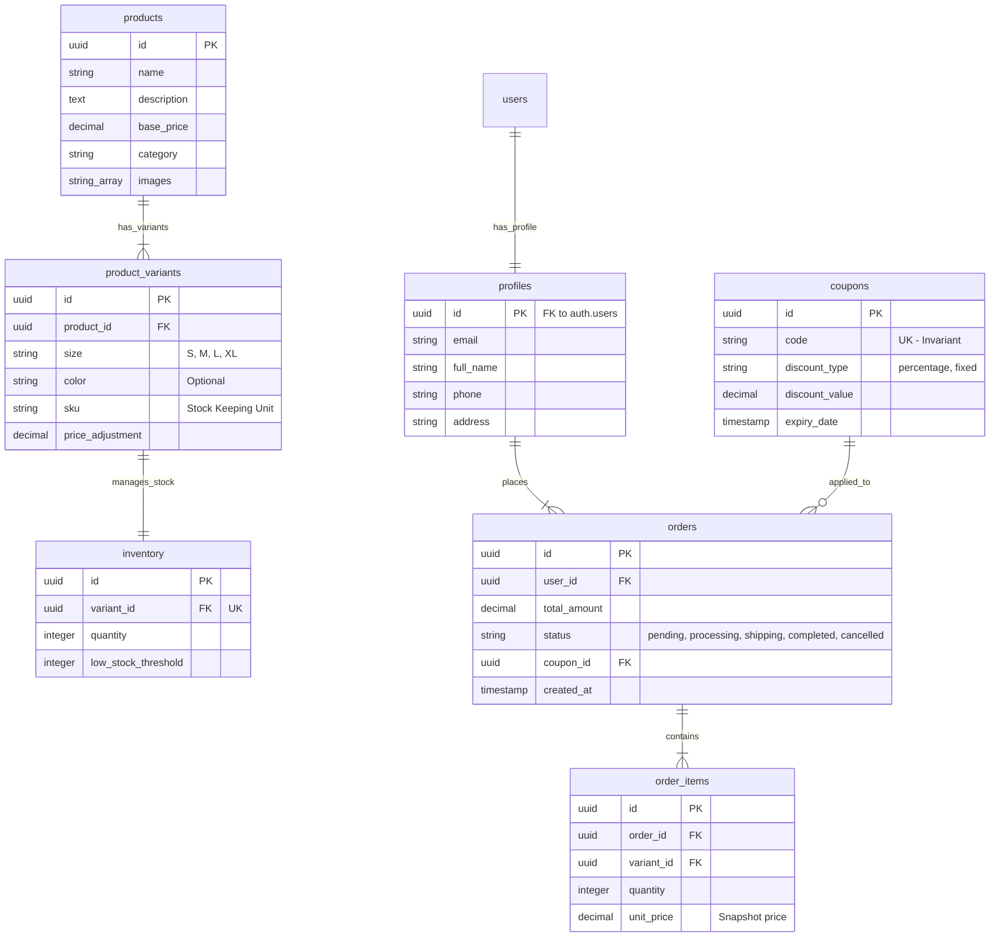

# Đặc tả Thiết kế Cơ sở Dữ liệu - Niee8 E-commerce

Tài liệu này trình bày kiến trúc cơ sở dữ liệu chuẩn hóa cho hệ thống thời trang Niee8, tập trung vào hiệu suất cao, tính minh bạch và khả năng mở rộng trên nền tảng Supabase (PostgreSQL).

## 1. Sơ đồ Thực thể Liên kết (ERD)



## 2. Chiến lược Đánh chỉ mục (Indexing Strategy)

Chúng ta triển khai 5 lớp Index để tối ưu hóa hiệu năng:

| Loại Index | Mục tiêu | Cột áp dụng |
| :--- | :--- | :--- |
| **B-Tree (Unique)** | Đảm bảo tính duy nhất & Tra cứu nhanh | `coupons(code)`, `product_variants(sku)` |
| **GIN (Full-Text)** | Tìm kiếm sản phẩm theo từ khóa | `products(name, description)` |
| **Composite B-Tree** | Tối ưu hóa Lọc & Sắp xếp (Sorting) | `products(category, created_at DESC)`, `products(category, base_price)` |
| **Relationship B-Tree** | Tăng tốc độ JOIN giữa các bảng | `product_variants(product_id)`, `order_items(order_id)`, `orders(user_id)` |
| **Partial Index** | Cảnh báo tồn kho thấp (Low Stock) | `inventory(quantity)` WHERE `quantity <= low_stock_threshold` |

## 3. Mã triển khai (SQL Script)

Bạn có thể chạy đoạn Script này trong Supabase SQL Editor để khởi tạo cấu trúc dữ liệu chuẩn hóa:

```sql
-- 1. Bật phần mở rộng cần thiết
CREATE EXTENSION IF NOT EXISTS "uuid-ossp";

-- 2. Tạo các bảng cốt lõi
CREATE TABLE profiles (
  id UUID PRIMARY KEY REFERENCES auth.users(id),
  full_name TEXT,
  phone TEXT,
  address TEXT,
  created_at TIMESTAMPTZ DEFAULT NOW()
);

CREATE TABLE products (
  id UUID PRIMARY KEY DEFAULT uuid_generate_v4(),
  name TEXT NOT NULL,
  description TEXT,
  base_price DECIMAL(12,2) NOT NULL,
  category TEXT,
  images TEXT[],
  created_at TIMESTAMPTZ DEFAULT NOW()
);

CREATE TABLE product_variants (
  id UUID PRIMARY KEY DEFAULT uuid_generate_v4(),
  product_id UUID REFERENCES products(id) ON DELETE CASCADE,
  size TEXT NOT NULL,
  color TEXT,
  sku TEXT UNIQUE NOT NULL,
  price_adjustment DECIMAL(12,2) DEFAULT 0,
  created_at TIMESTAMPTZ DEFAULT NOW()
);

CREATE TABLE inventory (
  id UUID PRIMARY KEY DEFAULT uuid_generate_v4(),
  variant_id UUID UNIQUE REFERENCES product_variants(id) ON DELETE CASCADE,
  quantity INTEGER DEFAULT 0,
  low_stock_threshold INTEGER DEFAULT 5
);

CREATE TABLE coupons (
  id UUID PRIMARY KEY DEFAULT uuid_generate_v4(),
  code TEXT UNIQUE NOT NULL,
  discount_type TEXT CHECK (discount_type IN ('percentage', 'fixed_amount')),
  discount_value DECIMAL(12,2) NOT NULL,
  expiry_date TIMESTAMPTZ,
  is_active BOOLEAN DEFAULT TRUE
);

CREATE TABLE orders (
  id UUID PRIMARY KEY DEFAULT uuid_generate_v4(),
  user_id UUID REFERENCES profiles(id),
  total_amount DECIMAL(12,2) NOT NULL,
  status TEXT DEFAULT 'pending',
  coupon_id UUID REFERENCES coupons(id),
  created_at TIMESTAMPTZ DEFAULT NOW()
);

CREATE TABLE order_items (
  id UUID PRIMARY KEY DEFAULT uuid_generate_v4(),
  order_id UUID REFERENCES orders(id) ON DELETE CASCADE,
  variant_id UUID REFERENCES product_variants(id),
  quantity INTEGER NOT NULL,
  unit_price DECIMAL(12,2) NOT NULL
);

-- 3. Tạo các Index tối ưu hóa
CREATE INDEX idx_products_search ON products USING GIN (to_tsvector('vietnamese', name || ' ' || description));
CREATE INDEX idx_products_cat_date ON products (category, created_at DESC);
CREATE INDEX idx_variants_pid ON product_variants (product_id);
CREATE INDEX idx_inventory_low_stock ON inventory (quantity) WHERE quantity <= low_stock_threshold;
CREATE INDEX idx_order_items_oid ON order_items (order_id);
```

## 4. Nguyên tắc Vận hành (Architectural Best Practices)

- **Chuẩn hóa (Normalization):** Dữ liệu được chia nhỏ để tránh trùng lặp và đảm bảo tính nhất quán.
- **Snapshot Price:** Luôn lưu `unit_price` trong bảng `order_items` để giữ nguyên giá trị đơn hàng khi giá sản phẩm gốc thay đổi.
- **RLS (Row Level Security):** Luôn bật RLS trên Supabase để đảm bảo người dùng chỉ có thể xem/sửa đơn hàng của chính mình.
- **Audit Logs:** Các thao tác quan trọng liên quan đến kho và đơn hàng nên được ghi log.
