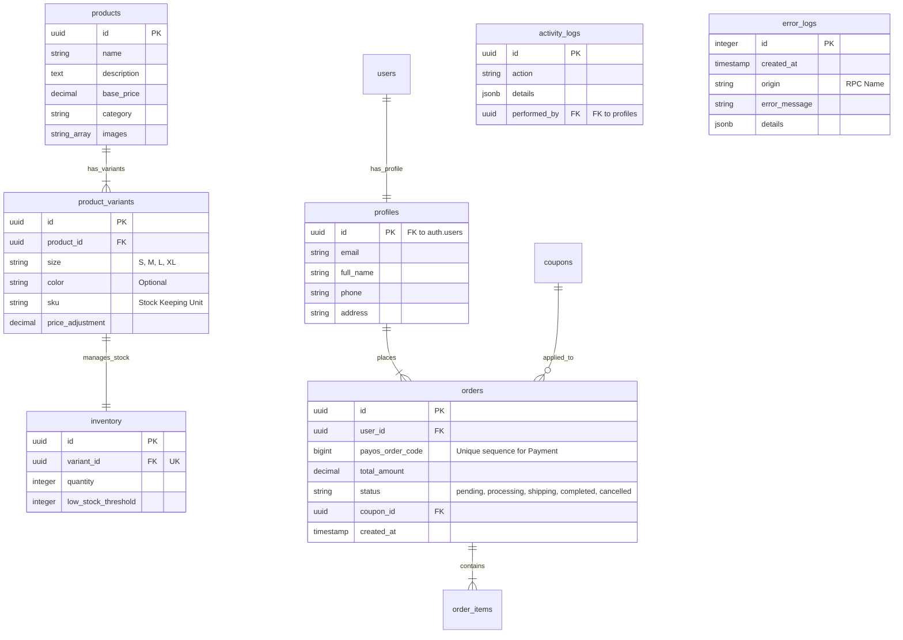

# Đặc tả Thiết kế Cơ sở Dữ liệu - Niee8 E-commerce

Tài liệu này trình bày kiến trúc cơ sở dữ liệu chuẩn hóa cho hệ thống thời trang Niee8, tập trung vào hiệu suất cao, tính minh bạch và khả năng mở rộng trên nền tảng Supabase (PostgreSQL).

## 1. Sơ đồ Thực thể Liên kết (ERD)



## 2. Chiến lược Đánh chỉ mục (Indexing Strategy)

Chúng ta triển khai các lớp Index để tối ưu hóa hiệu năng:

| Loại Index | Mục tiêu | Cột áp dụng |
| :--- | :--- | :--- |
| **B-Tree (Unique)** | Đảm bảo tính duy nhất & Tra cứu nhanh | `orders(payos_order_code)`, `coupons(code)` |
| **GIN (Full-Text)** | Tìm kiếm sản phẩm theo từ khóa | `products(name, description)` |
| **Relationship B-Tree** | Tăng tốc độ JOIN | `orders(user_id)`, `activity_logs(performed_by)` |

## 3. Mã triển khai (SQL Script - Phiên bản Bảo mật)

```sql
-- 1. Khởi tạo Sequence & Log Tables
CREATE SEQUENCE payos_order_code_seq START 100000;

CREATE TABLE error_logs (
    id SERIAL PRIMARY KEY,
    created_at TIMESTAMPTZ DEFAULT NOW(),
    origin TEXT,
    error_message TEXT,
    details JSONB
);

-- 2. Cập nhật bảng Orders & Activity
ALTER TABLE orders ADD COLUMN payos_order_code BIGINT UNIQUE DEFAULT nextval('payos_order_code_seq');
ALTER TABLE activity_logs ADD COLUMN performed_by UUID REFERENCES profiles(id);

-- 3. RPC: secure_checkout (Atomic Logic)
CREATE OR REPLACE FUNCTION secure_checkout(...) -- Xem tệp supabase-security-hardening-final.sql để biết chi tiết
```

## 4. Nguyên tắc Vận hành (Architectural Best Practices)

- **Atomic Checkout:** Toàn bộ quá trình kiểm tra giá, trừ kho và tạo đơn được bọc trong một Database Transaction duy nhất qua RPC.
- **Server-side Calculation:** Tuyệt đối không tin tưởng giá trị `total_amount` từ client; mọi phép tính phải được thực thi lại trong Database.
- **Idempotency:** Webhook thanh toán dựa trên `payos_order_code` và trạng thái `pending` để tránh xử lý trùng.
- **Audit Logging:** Mọi thao tác trọng yếu đều được ghi vết người thực hiện qua `performed_by`.
