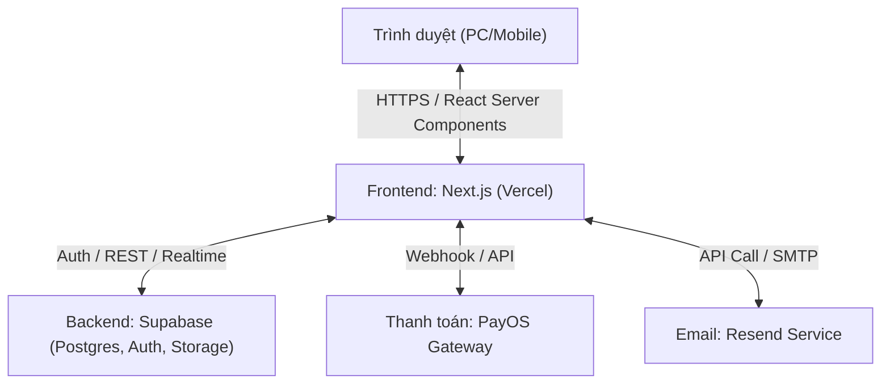
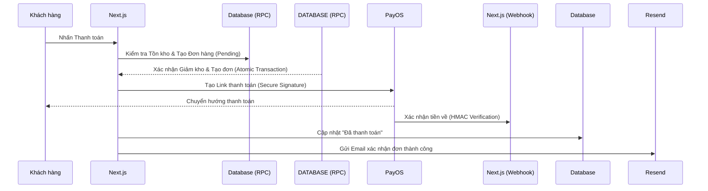

# Báo cáo Kiến trúc & Kiểm tra Hệ thống (System Audit & Architecture) - Niee8

Tài liệu này tổng hợp cấu trúc giải pháp và kết quả đánh giá độ tin cậy của hệ thống thương mại điện tử Niee8, được thực hiện bởi **Solutions Architect**.

## 1. Kiến trúc Hệ thống Tổng thể

## 2. Luồng Thanh toán & Xử lý Giao dịch (Sequence Diagram)

Hệ thống Niee8 áp dụng cơ chế xử lý đồng bộ và bất đồng bộ để đảm bảo trải nghiệm khách hàng và tính chính xác của kho hàng:

## 3. Kết quả Kiểm tra Bảo mật & Bền vững (Security Audit)

| Tiêu chí | Đánh giá | Chi tiết Kỹ thuật |
| :--- | :--- | :--- |
| **Chống thao túng giá** | **Xuất sắc (V5)** | Sử dụng RPC `secure_checkout` để tính toán lại giá 100% từ Database, loại bỏ hoàn toàn rủi ro Price Override. |
| **Toàn vẹn kho hàng** | **Xuất sắc** | Atomic Transaction: Trừ kho và tạo đơn được thực hiện trong cùng một nhịp đập của DB, chống Race Condition. |
| **Xác thực Webhook** | **Chuẩn SDK** | Sử dụng `@payos/node` chuẩn để xác thực chữ ký HMAC-SHA256, đảm bảo tính duy nhất và an toàn cho dòng tiền. |
| **Idempotency** | **Đảm bảo** | Kiểm tra trạng thái và sử dụng `payos_order_code` để ngăn chặn việc xử lý webhook trùng lặp. |
| **Đồng bộ Link Expiry** | **Hoàn thiện** | `expiredAt` trong link thanh toán khớp chính xác với 15 phút của hệ thống, tránh việc khách thanh toán đơn đã hủy. |

## 4. Các điểm Ghi chú Vận hành (Operational Notes)

- **Atomic Checkout Logic:** Một hàm duy nhất (`secure_checkout`) xử lý: Giá -> Kho -> Coupon -> Order. Nếu một bước lỗi, toàn bộ sẽ rollback để đảm bảo hệ thống không bao giờ ở trạng thái không nhất quán.
- **Hệ thống Error Logging:** Bảng `error_logs` được thiết kế để "túm" mọi lỗi phát sinh trong RPC, giúp quản trị viên debug và tra soát dòng tiền cực nhanh.
- **Hoàn kho an toàn:** Cơ chế hoàn kho dựa hoàn toàn trên Trigger DB (`on_order_cancelled`), tự động kích hoạt ngay cả khi Admin thao tác trực tiếp trên Supabase Dashboard.
- **Traceability:** Mọi hành động nhạy cảm đều được định danh qua cột `performed_by` trong nhật ký hệ thống.

---
**Kết luận:** Hệ thống Niee8 hiện tại đạt tiêu chuẩn **Enterprise-Grade** về xử lý thanh toán và quản trị rủi ro dòng tiền.
