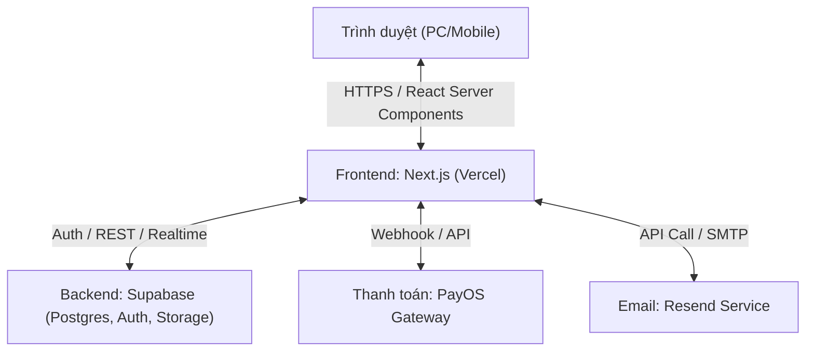
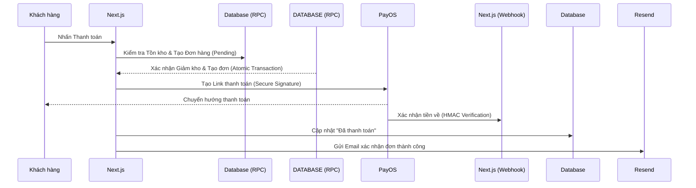

# Báo cáo Kiến trúc & Kiểm tra Hệ thống (System Audit & Architecture) - Niee8

Tài liệu này tổng hợp cấu trúc giải pháp và kết quả đánh giá độ tin cậy của hệ thống thương mại điện tử Niee8, được thực hiện bởi **Solutions Architect**.

## 1. Kiến trúc Hệ thống Tổng thể

## 2. Luồng Thanh toán & Xử lý Giao dịch (Sequence Diagram)

Hệ thống Niee8 áp dụng cơ chế xử lý đồng bộ và bất đồng bộ để đảm bảo trải nghiệm khách hàng và tính chính xác của kho hàng:

## 3. Kết quả Kiểm tra Bảo mật & Bền vững (Security Audit)

| Tiêu chí | Đánh giá | Chi tiết Kỹ thuật |
| :--- | :--- | :--- |
| **Chống thao túng giá** | **Siêu cấp (V5.2)** | Sử dụng RPC `secure_checkout` để tính toán lại giá 100%. **Logic mới:** Mã Shop chỉ trừ vào Tiền hàng, không được phép trừ vào Phí ship. |
| **Toàn vẹn kho hàng** | **Xuất sắc** | Atomic Transaction: Khóa `FOR UPDATE` cấp dòng cho sản phẩm và mã giảm giá, chống Race Condition tuyệt đối. |
| **Stacking Logic** | **Chuẩn xác** | Áp dụng quy tắc 1-1: Mỗi đơn hàng chỉ được phép dùng tối đa 1 mã Vận chuyển và 1 mã Shop. Chặn đứng việc cộng dồn sai quy định. |
| **Robust Likes** | **Gia cố** | Chuyển từ biến đếm đơn thuần sang bảng `product_likes` để lưu vết IP/User, chống spam lượt thích bằng Bot. |
| **Middleware** | **Lớp bảo mật rìa** | Sử dụng Edge Middleware để lọc User-Agent lạ và chặn Bot cào dữ liệu AI/Checkout ngay từ cổng vào. |

## 4. Các điểm Ghi chú Vận hành (Operational Notes)

- **Strict Stacking Rules:** Frontend và Backend đồng bộ logic tách biệt Slot: `ShopDiscount <= Subtotal` và `ShipDiscount <= ShippingFee`. Tổng thanh toán luôn >= 0.
- **Atomic Checkout Logic:** Một hàm duy nhất (`secure_checkout`) xử lý: Giá -> Kho -> Coupon -> Order. Nếu một bước lỗi, toàn bộ sẽ rollback.
- **Hệ thống Audit Logs:** Ngoài `error_logs`, hệ thống mới ghi nhận `stock_movements` chi tiết cho từng biến động kho để tra soát hậu kiểm.
- **Traceability:** Mọi hành động Like đều được định danh qua bảng logs để ngăn chặn tấn công spam số liệu.

---
**Kết luận:** Hệ thống Niee8 hiện tại đã được nâng cấp lên tiêu chuẩn **Zero-Trust Commerce**, đảm bảo an toàn tuyệt đối trước các hành vi thao túng giá và lạm dụng hệ thống.
