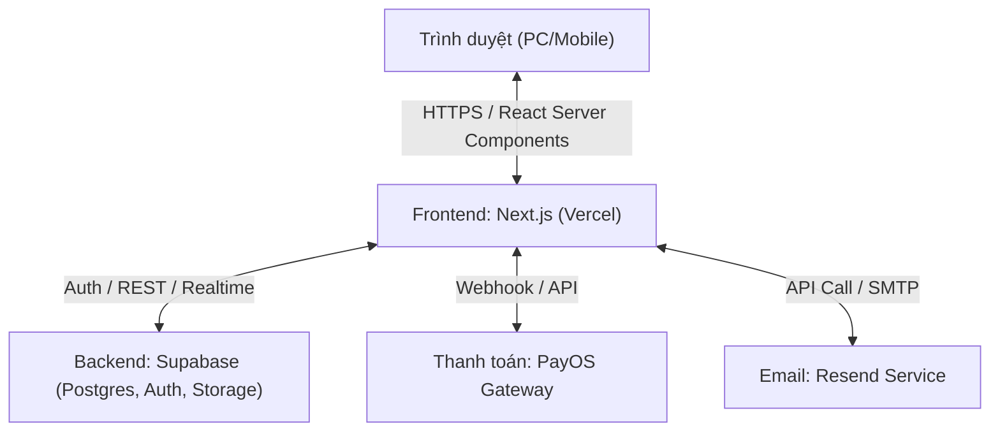
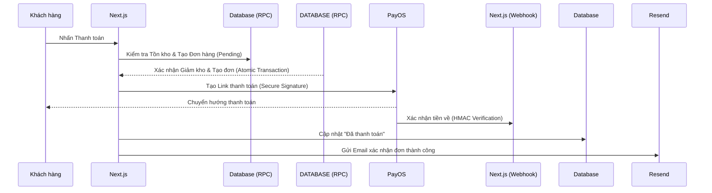

# Báo cáo Kiến trúc & Kiểm tra Hệ thống (System Audit & Architecture) - Niee8

Tài liệu này tổng hợp cấu trúc giải pháp và kết quả đánh giá độ tin cậy của hệ thống thương mại điện tử Niee8, được thực hiện bởi **Solutions Architect**.

## 1. Kiến trúc Hệ thống Tổng thể

## 2. Luồng Thanh toán & Xử lý Giao dịch (Sequence Diagram)

Hệ thống Niee8 áp dụng cơ chế xử lý đồng bộ và bất đồng bộ để đảm bảo trải nghiệm khách hàng và tính chính xác của kho hàng:

## 3. Kết quả Kiểm tra Bảo mật & Bền vững (Security Audit)

| Tiêu chí | Đánh giá | Chi tiết Kỹ thuật |
| :--- | :--- | :--- |
| **Chống thao túng giá** | **Xuất sắc** | Sử dụng RPC `secure_checkout` để tính toán lại giá từ Database, bỏ qua giá từ Client gửi lên. |
| **Toàn vẹn kho hàng** | **Xuất sắc** | Sử dụng `FOR UPDATE` để khóa dòng dữ liệu, tránh tình trạng quá bán (Overselling) khi nhiều người mua cùng lúc. |
| **Idempotency** | **Đảm bảo** | Webhook chỉ xử lý đơn hàng ở trạng thái `pending`, ngăn chặn việc cập nhật trùng lặp trạng thái. |
| **Xác thực Webhook** | **Đảm bảo** | Kiểm tra chữ ký số HMAC-SHA256 trên mỗi yêu cầu từ cổng thanh toán. |
| **Dọn dẹp & Hoàn kho** | **Hoàn thiện** | Cron job tự động quét và hoàn trả số lượng vào kho (`restore_stock`) cho các đơn hàng bỏ dở sau 15 phút. |

## 4. Các điểm Ghi chú Vận hành (Operational Notes)

- **RPC cancel_order_safe:** Một hàm cực kỳ quan trọng giúp hoàn trả cả **Hàng hóa** và **Lượt dùng mã giảm giá** cho khách hàng khi giao dịch thất bại.
- **Dọn dẹp tự động:** Hệ thống sử dụng Vercel Cron để duy trì độ chính xác của kho hàng 24/7 mà không cần sự can thiệp của con người.
- **Bảo mật RLS:** Mọi bảng dữ liệu quan trọng đều được thắt chặt bằng chính sách Row Level Security (RLS) của Supabase.

---
**Kết luận:** Hệ thống Niee8 hiện tại được xây dựng trên một nền tảng kỹ thuật vững chắc, tuân thủ các nguyên lý thiết kế tiên tiến của Cloud-native và Database-driven architecture.
